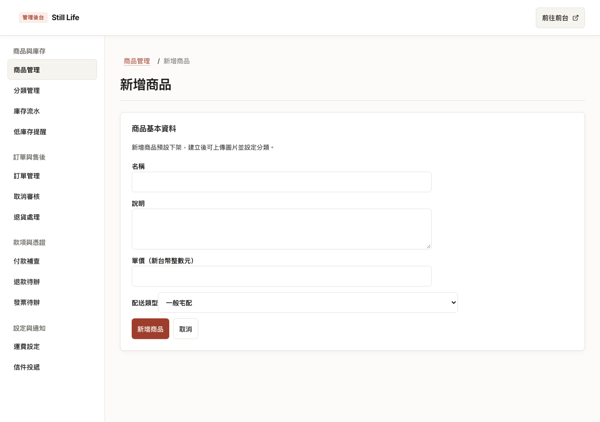
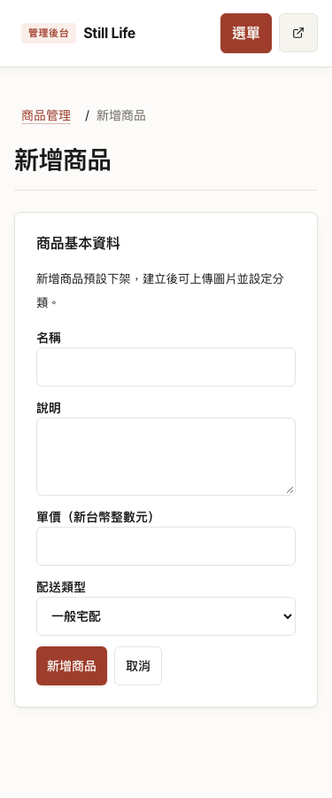
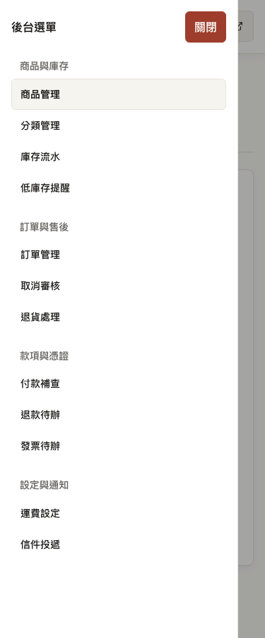

# 後台分組導覽與共用框架（#130）

規格：[GitHub #130](https://github.com/CarlLee1983/Storefront/issues/130)，父規格 #129。基準：`22920fec7988e71a8692368acae46e2e08432b52`。驗證日期：2026-10-04。

狀態：本機實作、完整檢查與獨立審查完成。

## 交付範圍

共用 `AdminLayout.astro` 使用單一導覽資料，透過 `AdminNavigation.astro` 呈現四組、12 個完整文字入口。64rem 以上為固定且可捲動的側欄；以下使用具名稱的原生 dialog 抽屜。商品新增／編輯、分類編輯、訂單明細均有目前功能標示與返回所屬列表的麵包屑。

抽屜支援鍵盤、Escape、關閉後焦點返回；跨至桌機寬度時關閉 modal 並將焦點移至側欄。保留 skip link、前往前台、noindex、既有 403／404 與 Access 保護。商品表格的操作欄在側欄版型下可換行，以保留 44px 控制項及 1280px 表格不溢出的既有契約。seed 的後台辨識在窄視窗會開啟抽屜驗證可見導覽，成功或拒絕後皆關閉；原有 URL、response、標題與連結核對仍保留。

商品列表仍是 `/admin`。預設入口／路由調整屬 #131；來源搜尋、篩選與頁碼的返回保留屬 #132、#133。本張不新增這些行為。

## 驗證

沿用 Playwright 正式建置、Web／App／模擬閘道三個 Worker 與隔離的本機 E2E 狀態。

| 檢查 | 結果 |
| --- | --- |
| `bun run typecheck` | 通過；零錯誤、零警告，4 個既有 hints |
| `bun run test:coverage` | 通過：Gateway 103、App 1,078、Web 643 項；各套件 coverage 門檻通過 |
| `bun run --filter @storefront/e2e test` | 通過：13 項 seed 單元測試 |
| 最終完整 `bun run e2e` | 通過：156／156 項，4.8 分鐘，exit 0；沒有失敗或相依跳過 |

新增 `admin-navigation.spec.ts` 驗證桌機與手機全部入口、分組順序、目前功能、直接開啟深層頁面的麵包屑、抽屜鍵盤操作與焦點、44px 控制項、1280×480 短視窗、1023／1024 版型切換、375px 無水平溢出與 axe。既有 `admin-shell.spec.ts` 保留正常、深層與 403／404 頁面、skip link、noindex、頁尾隔離、操作尺寸及 axe；商品新增、分類、訂單與 seed guard 測試改由可見導覽操作。seed guard 在 375／1280 均驗證真實頁面、錯誤頁、重新導向與錯誤商品連結。

TDD 先重現缺少分組標題、手機選單、麵包屑與窄視窗 seed 辨識失敗，再加入對應實作。整合時，原有訂單明細表格測得容器 958px、內容 976px；側欄改為 14rem 後，訂單與導覽 5 項回歸通過。第一輪完整 E2E 為 121 通過、1 失敗、34 相依測試未執行：商品表格容器 990px、內容 1100px。修正操作欄換行後，商品、訂單與導覽的 8 項回歸全部通過；接著重新執行完整套件，不放寬原本的溢出或控制項尺寸斷言。

## 畫面

正式建置的本機畫面，沿用既有色彩與字型。桌機側欄與內容分隔，手機關閉抽屜時保留完整內容寬度；抽屜顯示四組全部入口。截圖另配合上述鍵盤與 axe 檢查，不能單憑畫面推定無障礙通過。

## 整合與回滾

沒有新增套件、資料遷移、API 或權限規則變更。這次只需部署 Web 建置；本次未部署。回滾時一併還原共用版面、導覽元件、後台 CSS、seed 辨識與對應 E2E，避免測試仍預期新導覽。沒有需要復原的資料格式。

Standards 與 Spec 分別完成獨立審查，原審查者另確認最終 CSS 修正與驗收紀錄，兩軸皆無實質問題。主要代理已檢視最終差異與三張驗收截圖。
