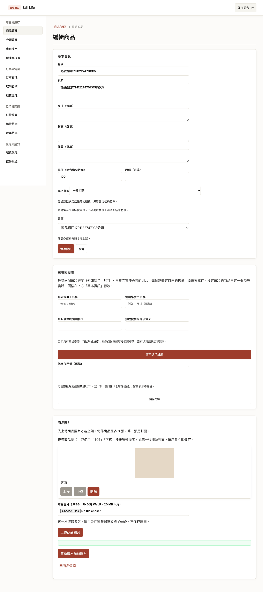
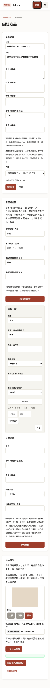
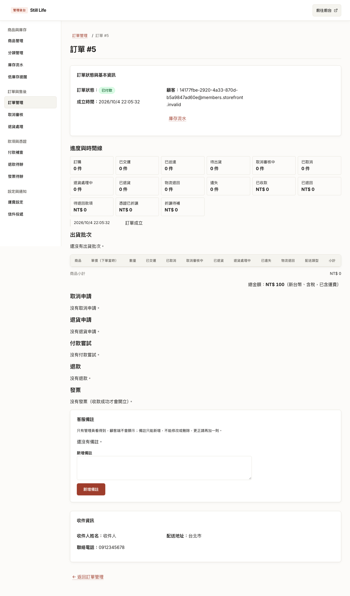
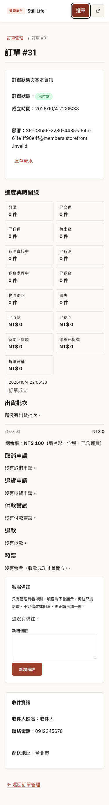
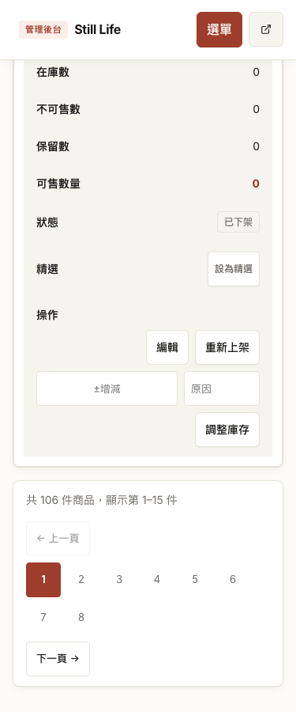

# 後台首頁、商品路徑與列表返回（#131–#133）

規格：[#131](https://github.com/CarlLee1983/Storefront/issues/131)、[#132](https://github.com/CarlLee1983/Storefront/issues/132)、[#133](https://github.com/CarlLee1983/Storefront/issues/133)，父規格 #129。基準：`67fc037`（已整合 #130）。驗證日期：2026-10-04。

狀態：本機實作、整合驗證與獨立審查完成，尚未部署。

## 交付與驗收邊界

| 項目 | 可觀察驗收 |
| --- | --- |
| #131 根入口 | `/admin` 與後台品牌前往訂單管理；商品導覽指向 `/admin/products` |
| #131 商品流程 | GET 查找／分頁、列表 POST、既有新增／編輯、儲存與取消均維持商品流程；seed 辨識新列表 |
| #132 商品返回 | 以第二頁篩選結果進入編輯，麵包屑、取消、儲存及變體提交後返回，核對條件與實際商品列 |
| #133 訂單返回 | 以第二頁查找結果進入明細，立即返回或新增備註後返回，核對條件、游標與實際訂單列 |
| 目的地限制 | 直接深層連結回預設列表；外部、錯誤列表、路徑變形及不合法返回參數不採用 |
| 框架與回歸 | 375／1280、鍵盤、axe、目前功能、403／404、相關案件捷徑及既有業務操作 |

`admin/list-return.ts` 統一限制返回目的地與查找參數。商品允許 `q/status/category/page`，訂單允許 `orderId/email/status/from/to/before`；不攜帶列表的操作提示。明細的返回條件與操作提示分開保留；訂單明細的 15 個成功轉址、商品變體成功轉址均使用同一連結組合函式。表單提交沿用目前網址，因此驗證失敗重新顯示時也保留來源。

## 驗證結果

使用既有正式建置、三個 Worker 的 Playwright harness 與隔離 E2E D1；不新增測試 API。

| 檢查 | 結果 |
| --- | --- |
| `bun run typecheck` | 通過；0 errors、0 warnings、4 個既有 hints；最終變更後 Web 與 E2E typecheck 再次通過 |
| `bun run test:coverage` | 通過：App 1,078、Gateway 103、Web 683 項；各套件四項 coverage 均超過 80% |
| `bun run --filter @storefront/e2e test` | 通過：13 項 seed 單元測試 |
| 第一輪焦點 E2E | 21 通過、2 失敗，exit 1；失敗與修正見下文 |
| 返回／時間線複驗 | 兩個時間線案例通過；修正後兩個訂單返回及一個涵蓋桌機／手機的商品返回案例 3／3 通過，exit 0 |
| 第一輪完整 E2E | 125 通過、1 失敗、34 相依案例未執行；手機商品分頁溢出，修正見下文 |
| 分頁修正焦點 E2E | 商品操作／返回、桌機／手機外殼與八頁分頁案例 7／7 通過，exit 0 |
| 最終完整 `bun run e2e` | 161／161 通過，exit 0；沒有失敗或相依跳過 |

第一輪焦點範圍為 `admin-navigation`、`admin-product-create`、`admin-products`、`admin-seed-guard`、`admin-product-return`、`admin-order-return`。失敗為新增商品返回測試的分類欄位定位不符合現有 accessible name，以及桌機訂單返回測試讀到空列表。手機訂單返回及既有商品操作／框架案例通過；本輪失敗不計為通過。

第二輪返回／時間線焦點為 3 通過、2 失敗：時間線桌機／手機及手機訂單返回通過；商品測試需區分成功提示與圖庫的空白 live region。訂單加上等待後仍讀到空列表，trace 證實伺服器實際回傳空結果：最後插入的排除用訂單時間早於前面 25 張訂單，不符合既有日期查找依賴的編號／時間順序。修正測試夾具為遞增時間，不更改既有查找規則；保留載入後再快照的等待斷言。

另將新訂單案例的日期範圍限於夾具所在的台北日期，避免其他案例較晚插入的 2021 歷史訂單影響全域日期編號邊界。一次完整 E2E 啟動由主要代理以 SIGINT 中止（exit 130），以先納入這項測試隔離修正，再從乾淨 harness 狀態重跑；該次中止不計入通過結果。

整合審查找到兩個遺漏並修正：商品 seed 清理工具的 ID 擷取沒有接受帶返回參數的連結；訂單時間線待辦捷徑仍使用不帶來源條件的明細網址。前者改為能解析 query 的連結，後者在 Web 頁面組合時間線連結時加入同一返回狀態，領域資料與規則不變。時間線另延伸既有桌機／手機案例驗證。

第一輪完整 E2E 在 `admin-shell` 的 375px 商品列表量到 421px 頁面寬度。Trace 當時已有 87 件商品、六個頁碼；既有分頁控制列不換行，44px 頁碼加上上一頁／下一頁超出手機內容寬度。保留原本無水平溢出與點擊尺寸斷言，只讓手機分頁列換行，並新增 106 件商品、八頁的獨立回歸案例：所有頁碼至少 44×44px、頁面不溢出、最後一頁只顯示第 106 件商品。夾具沿用隔離 E2E D1，使用獨有 UUID 名稱前綴，只建立下架商品及預設變體，並在 `finally` 清除自己建立的資料。

## 畫面

本機正式建置，從篩選後第二頁進入的編輯／明細畫面；375px 與 1280px 均沿用 #130 框架。商品案例使用 17 件符合條件商品及排除對照；訂單案例使用 25 張符合條件訂單及排除對照。畫面為隔離的測試資料，操作、返回結果與 axe 由上述 E2E 斷言驗證。

## 整合與回滾

沒有新增套件、RPC、資料庫遷移或權限規則；訂單、庫存、付款、退款、發票等業務呼叫與輸入保持原樣。正式整合只需 Web 建置，沒有資料轉換。本次未部署。回滾須一併還原路由、導覽、返回狀態、seed 與測試呼叫端，避免商品 POST 指向訂單首頁。

實作由 implementer 子代理分別完成商品與訂單切片，主要代理整合共用返回驗證邊界、文件與完整 gates；architect 分析返回網址邊界，獨立 reviewer 檢查實作、後續修正、測試與文件。所有實質審查發現均已處理；主要代理檢視最終差異與五張驗收截圖。
